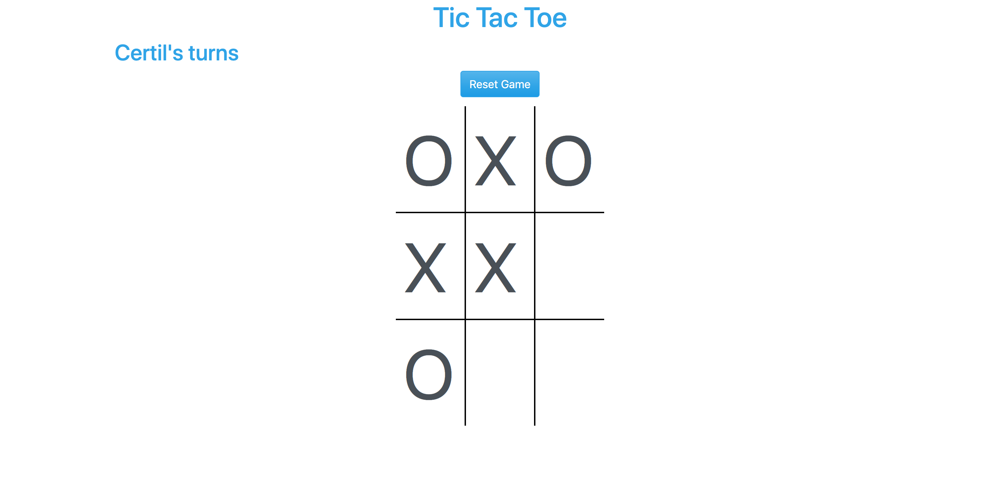

#   Tic-Tac-Toe
This is a titc-tac-toe game with With Java script. In this version you can only play with your friend no AI yet. Enter your name and tel your friend enter his name and start playing.

<p align="center">
    
</p>

## Live version of the production comming soon
https://certilremy.github.io/.../

### Feature Currently available:

* Play with friends

### New features in production :

* Play with AI

## Tech used 
* Html
* CSS (Bootstrap)
* JavaScript

## External library 

* Webpack 
* Jest for testing
* Babel


## Using the app in development 
Clone this repo (you need Node js installed in your computer).
```
$ git@github.com:TashfeenRao/tic.tac.toe.git
```

 Change to the app directory 
 
 ```
$ cd library
 ```

And run this to install dependencies 
```
$ npm install 
```

Run this to compile the package with webpack

```
$ npm run dev 
```

To run the tests 

```
$ npm run test
```


To start the server you don't need other special server you can go to the project folder ans click the index.html or install live server extention if you're using vsCode

## Author 

* Certil Remy    Github : https://github.com/certilremy
* Tashfeen Rao   Github : https://github.com/TashfeenRao
## Contribution 

If you want to contribute to this project you're welcome .
Follow the github runles and fork this repot and open your pull request. 
